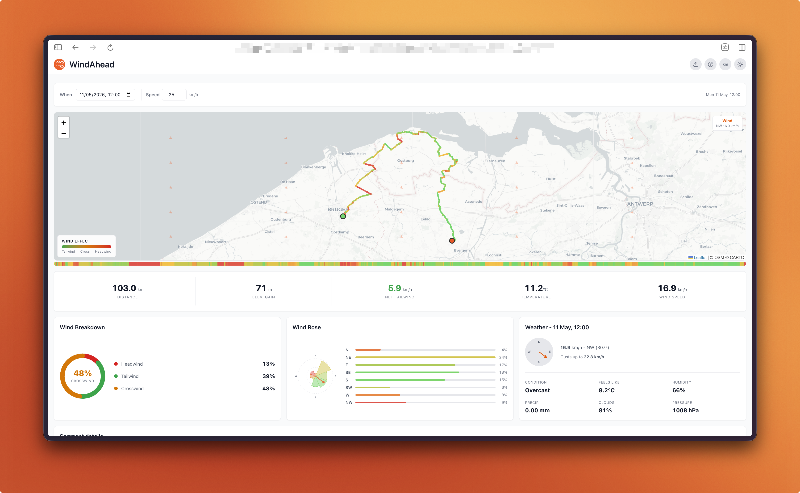

    

<h1 align="center">WindAhead</h1>

---

<h4 align="center">WindAhead is a client-side wind analyzer for cycling, running, and walking routes.</h4>

## Supported GPX sources

Most GPX files exported from **Strava**, **Komoot**, **Garmin**, **Wahoo**, or similar apps work out of the box.
Track points, route points, waypoints, and elevation data are all supported.

## How it works

1. **Upload** a GPX file
2. **Pick** a date/time and average speed
3. WindAhead fetches hourly wind forecasts from the [Open-Meteo API](https://open-meteo.com) and calculates headwind, crosswind, and tailwind for every segment of your route
